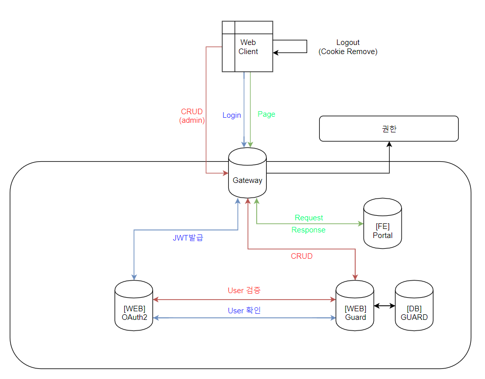

# OAuth2
###### Project MO

Project MO에서 인증 및 인가를 위해 사용하는  `OAuth2`서버입니다.

인증 및 인가기능만 가지고 있으며 따로 추가적인 비즈니스 로직을 가지지 않으며,

인증 및 인가시 필요에 따라 Guard API 서버에 요청하여 진행합니다. 

유저정보 관리에 대한 비즈니스 로직은 Guard API 서버(조직, 서비스, 유저, 권한 관리서버)에서 확인 가능합니다.

## 구조

## 인증

인증과정을 위해서 Spring Security가 적용되어 있습니다.

클라이언트가 인증을 요청하게 되면 Gateway를 통해 OAuth서버로 요청이 전달되게 됩니다. ( 인증 정보 없이 접근이 가능 )

OAuth 서버는 Authorization 헤더 정보가 있다면 검증을 위해서 Guard 서버에서 유저의 관련 정보를 요청 받습니다.

요청받은 패스워드 정보가 일치한다면 인증에 성공하게 되고 유저 정보를 내포한 JWT를 발급하여 클라이언트에게 전달합니다.

## 인가

OAuth서버에서 인가정보를 검증하기 위해서는 요청하기 위해서는 Guard서비스에 검증을 요청해야 합니다.

해당 방식은 막대한 네트워크비용과 데이터베이스조회비용이 발생할 수 있습니다.

### 인가정보캐싱

따라서 OAuth서버는 조직의 정의된 권한 정보를 캐싱하여 미리 가지고 있어 네트워크와 데이터베이스 비용이 별도로 발생하는 것을 방지합니다.

조직의 인증정보를 캐싱하는 방법은 다양합니다.

- 인증 데이터를 파일 단위로 Oauth 서버에 전달하는 것
- 인증 데이터를 메시지큐에 전파하여 OAuth 서버에서 전달 받는 것

현재 아직 구성되지 않았습니다.

## JWT (Javascript Web Token)

인증을 통해 얻은 유저의 조직, 권한, 유저의 데이터를 JWT로 발급합니다.

JWT는 Gateway에서 파싱되며 만약 `Autherization 헤더` 에 JWT 인증정보가 없다면 

Project MO의 어떠한  API에도 접근할 수 없습니다. (단, 인증은 위한 API는 접근 가능)

JWT는 암호화와 복호화를 위한 `Key`를 가지고 있으며 해당 값은 Config 값에 존재합니다.

해당 Key는 오직 암호화를 진행하는 Oauth2서버와 복호화를 진행하는 Gateway에서만 가지고 있습니다.

따라서 해당 키값의 보안에 신경써야 하며, Netflix Config 서버를 이용하여 구성 정보를 별도로 관리하고 있습니다.